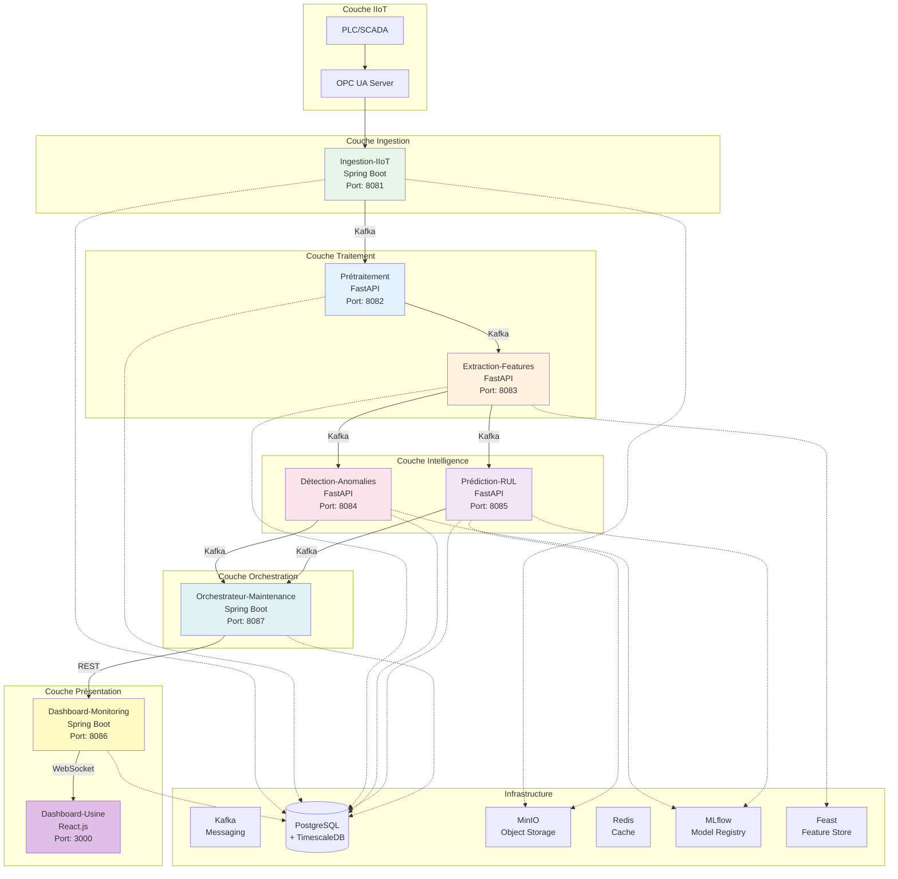

# Architecture Microservices - Maintenance Prédictive

## Vue d'Ensemble

Cette documentation décrit l'architecture microservices de la plateforme de maintenance prédictive, incluant les rôles, technologies, bases de données et méthodes de communication de chaque service.

---

## 1. Schéma d'Architecture Global

---

## 2. Détail des Microservices

### 2.1 Service : Ingestion-IIoT

#### Rôle
Collecte et normalisation des données en temps-réel depuis les équipements industriels via différents protocoles (OPC UA, Modbus, MQTT).

#### Technologies Utilisées
- **Framework** : Spring Boot 3.2.0
- **Langage** : Java 17
- **Bibliothèques Principales** :
  - Spring Kafka (messaging)
  - Eclipse Milo (OPC UA client)
  - Spring Data JPA (persistence)
  - Jackson (sérialisation JSON)
  - MinIO SDK (object storage)
- **Build Tool** : Maven 3.9

#### Base de Données
- **PostgreSQL + TimescaleDB** :
  - Table `sensor_data` (hypertable) : Stockage des données brutes avec compression
  - Table `assets` : Métadonnées des équipements
  - Table `sensors` : Métadonnées des capteurs
- **MinIO** :
  - Bucket `raw-sensor-data` : Archivage des données brutes (format Parquet)

#### Communication
- **Asynchrone (Kafka)** :
  - **Topic** : `sensor-data`
  - **Format** : JSON
  - **Fréquence** : Temps-réel (1-10 Hz)
  - **Direction** : Producer (publie les données collectées)
- **Synchrone (REST)** :
  - **Endpoints** :
    - `GET /api/v1/ingestion/health` : Health check
    - `POST /api/v1/ingestion/start` : Démarrer l'ingestion
    - `POST /api/v1/ingestion/stop` : Arrêter l'ingestion
  - **Format** : JSON
  - **Direction** : Expose des APIs pour contrôle

#### Port
- **8081**

---

### 2.2 Service : Prétraitement

#### Rôle
Nettoyage, normalisation et préparation des données brutes pour l'analyse et l'extraction de caractéristiques.

#### Technologies Utilisées
- **Framework** : FastAPI 0.104.1
- **Langage** : Python 3.11
- **Bibliothèques Principales** :
  - Pandas (manipulation données)
  - NumPy (calculs numériques)
  - SciPy (traitement signal)
  - Confluent Kafka (messaging)
  - psycopg2 (PostgreSQL)
  - Uvicorn (serveur ASGI)

#### Base de Données
- **PostgreSQL + TimescaleDB** :
  - Table `preprocessed_data` (hypertable) : Données prétraitées
  - Table `preprocessing_metadata` : Métadonnées des opérations

#### Communication
- **Asynchrone (Kafka)** :
  - **Consumer** : `sensor-data` (consomme les données brutes)
  - **Producer** : `preprocessed-data` (publie les données prétraitées)
  - **Format** : JSON
  - **Direction** : Bidirectionnelle (consomme et produit)
- **Synchrone (REST)** :
  - **Endpoints** :
    - `GET /api/v1/preprocessing/health`
    - `POST /api/v1/preprocessing/process` : Traitement manuel
    - `GET /api/v1/preprocessing/stats` : Statistiques
  - **Format** : JSON

#### Port
- **8082**

---

### 2.3 Service : Extraction-Features

#### Rôle
Extraction de caractéristiques temporelles, fréquentielles et par ondelettes à partir des données prétraitées.

#### Technologies Utilisées
- **Framework** : FastAPI 0.104.1
- **Langage** : Python 3.11
- **Bibliothèques Principales** :
  - tsfresh (extraction features temporelles)
  - PyWavelets (ondelettes)
  - scipy.fft (analyse fréquentielle)
  - Feast (feature store)
  - Pandas, NumPy
  - Confluent Kafka

#### Base de Données
- **PostgreSQL + TimescaleDB** :
  - Table `extracted_features` (hypertable) : Features extraites
  - Table `feature_definitions` : Définitions des features
- **Feast Feature Store** :
  - Entity : `asset`, `sensor`
  - Features : Caractéristiques standardisées par type d'actif

#### Communication
- **Asynchrone (Kafka)** :
  - **Consumer** : `preprocessed-data`
  - **Producer** : `extracted-features`
  - **Format** : JSON avec features structurées
- **Synchrone (REST)** :
  - **Endpoints** :
    - `GET /api/v1/features/health`
    - `POST /api/v1/features/extract` : Extraction manuelle
    - `GET /api/v1/features/{asset_id}` : Features d'un actif
  - **Format** : JSON

#### Port
- **8083**

---

### 2.4 Service : Détection-Anomalies

#### Rôle
Détection d'anomalies en temps-réel à partir des features extraites en utilisant plusieurs modèles ML.

#### Technologies Utilisées
- **Framework** : FastAPI 0.104.1
- **Langage** : Python 3.11
- **Bibliothèques Principales** :
  - PyOD (détection anomalies)
  - scikit-learn (Isolation Forest, One-Class SVM)
  - PyTorch (LSTM Autoencoder)
  - MLflow (gestion modèles)
  - Confluent Kafka
  - psycopg2

#### Base de Données
- **PostgreSQL** :
  - Table `anomaly_events` : Événements d'anomalies détectées
  - Table `anomaly_models` : Métadonnées des modèles
- **MLflow** :
  - Registry des modèles d'anomalies
  - Tracking des expériences
  - Stockage des artefacts (modèles entraînés)

#### Communication
- **Asynchrone (Kafka)** :
  - **Consumer** : `extracted-features`
  - **Producer** : `anomalies-detected`
  - **Format** : JSON avec score d'anomalie et criticité
- **Synchrone (REST)** :
  - **Endpoints** :
    - `GET /api/v1/anomalies/health`
    - `POST /api/v1/anomalies/detect` : Détection manuelle
    - `GET /api/v1/anomalies/{asset_id}` : Historique anomalies
    - `POST /api/v1/anomalies/train` : Entraînement modèles
  - **Format** : JSON

#### Port
- **8084**

---

### 2.5 Service : Prédiction-RUL

#### Rôle
Prédiction de la Remaining Useful Life (RUL) des équipements en utilisant des modèles de deep learning et machine learning.

#### Technologies Utilisées
- **Framework** : FastAPI 0.104.1
- **Langage** : Python 3.11
- **Bibliothèques Principales** :
  - PyTorch (LSTM, GRU, TCN)
  - XGBoost (modèle ensemble)
  - scikit-learn (calibration)
  - MLflow (gestion modèles)
  - Confluent Kafka
  - psycopg2

#### Base de Données
- **PostgreSQL** :
  - Table `rul_predictions` : Prédictions RUL historiques
  - Table `rul_models` : Métadonnées des modèles
  - Table `rul_training_data` : Données d'entraînement
- **MLflow** :
  - Registry des modèles RUL
  - Versioning des modèles
- **MinIO** :
  - Bucket `rul-models` : Stockage des modèles PyTorch

#### Communication
- **Asynchrone (Kafka)** :
  - **Consumer** : `extracted-features`
  - **Producer** : `rul-predictions`
  - **Format** : JSON avec RUL prédit et intervalle de confiance
- **Synchrone (REST)** :
  - **Endpoints** :
    - `GET /api/v1/rul/health`
    - `POST /api/v1/rul/predict` : Prédiction manuelle
    - `GET /api/v1/rul/{asset_id}` : Prédictions d'un actif
    - `POST /api/v1/rul/train` : Entraînement modèles
    - `GET /api/v1/rul/models` : Liste des modèles
  - **Format** : JSON

#### Port
- **8085**

---

### 2.6 Service : Orchestrateur-Maintenance

#### Rôle
Orchestration et planification optimisée des interventions de maintenance basées sur les anomalies et prédictions RUL.

#### Technologies Utilisées
- **Framework** : Spring Boot 3.2.0
- **Langage** : Java 17
- **Bibliothèques Principales** :
  - Drools (moteur de règles métier)
  - OR-Tools (optimisation combinatoire)
  - Spring Kafka (messaging)
  - Spring Data JPA (persistence)
  - Jackson (JSON)

#### Base de Données
- **PostgreSQL** :
  - Table `work_orders` : Ordres de travail
  - Table `interventions` : Interventions planifiées
  - Table `maintenance_plans` : Plans de maintenance
  - Table `technicians` : Techniciens disponibles
  - Table `assets` : Métadonnées équipements

#### Communication
- **Asynchrone (Kafka)** :
  - **Consumer** :
    - `anomalies-detected` : Consomme les anomalies
    - `rul-predictions` : Consomme les prédictions RUL
  - **Producer** :
    - `work-orders` : Publie les ordres de travail créés
    - `maintenance-plans` : Publie les plans de maintenance
  - **Format** : JSON
- **Synchrone (REST)** :
  - **Endpoints** :
    - `GET /api/v1/work-orders` : Liste des WO
    - `POST /api/v1/work-orders` : Créer un WO
    - `GET /api/v1/work-orders/{id}` : Détails d'un WO
    - `PUT /api/v1/work-orders/{id}` : Mettre à jour un WO
    - `POST /api/v1/interventions` : Créer une intervention
    - `GET /api/v1/planning/optimize` : Optimiser la planification
  - **Format** : JSON

#### Port
- **8087**

---

### 2.7 Service : Dashboard-Monitoring

#### Rôle
Monitoring et supervision de l'ensemble de la plateforme, agrégation des métriques et alertes.

#### Technologies Utilisées
- **Framework** : Spring Boot 3.2.0
- **Langage** : Java 17
- **Bibliothèques Principales** :
  - Spring WebFlux (réactif)
  - Spring WebSocket (temps-réel)
  - Micrometer + Prometheus (métriques)
  - Spring Kafka (consommation événements)
  - Spring Data JPA

#### Base de Données
- **PostgreSQL** :
  - Table `system_metrics` : Métriques système
  - Table `alerts` : Alertes générées
  - Table `service_status` : État des services

#### Communication
- **Asynchrone (Kafka)** :
  - **Consumer** : Tous les topics pour agrégation
  - **Format** : JSON
- **Synchrone (REST)** :
  - **Endpoints** :
    - `GET /api/v1/monitoring/health` : Health global
    - `GET /api/v1/monitoring/metrics` : Métriques agrégées
    - `GET /api/v1/monitoring/alerts` : Alertes actives
    - `GET /api/v1/monitoring/services` : État des services
  - **Format** : JSON
- **WebSocket** :
  - **Endpoint** : `/ws/monitoring`
  - **Format** : JSON (push temps-réel)

#### Port
- **8086**

---

### 2.8 Service : Dashboard-Usine

#### Rôle
Interface utilisateur web pour visualisation temps-réel, cartographie GIS et gestion des interventions.

#### Technologies Utilisées
- **Framework** : React.js 18+
- **Langage** : TypeScript/JavaScript
- **Bibliothèques Principales** :
  - React Router (routing)
  - WebSocket Client (temps-réel)
  - Leaflet/OpenLayers (cartographie GIS)
  - Chart.js/Recharts (visualisation)
  - Axios (HTTP client)
  - Material-UI ou Ant Design (UI components)

#### Base de Données
- **Pas de base de données directe** : Consomme les APIs des autres services
- **Cache Local** : LocalStorage/SessionStorage pour préférences utilisateur

#### Communication
- **Synchrone (REST)** :
  - Consomme les APIs de tous les services
  - Format : JSON
- **WebSocket** :
  - Connexion au Dashboard-Monitoring pour données temps-réel
  - Format : JSON

#### Port
- **3000** (développement)
- **80/443** (production)

---

## 3. Matrice de Communication

| Service Source | Service Destination | Type | Outil | Topic/Endpoint | Format |
|---------------|-------------------|------|-------|----------------|--------|
| Ingestion-IIoT | Prétraitement | Asynchrone | Kafka | `sensor-data` | JSON |
| Prétraitement | Extraction-Features | Asynchrone | Kafka | `preprocessed-data` | JSON |
| Extraction-Features | Détection-Anomalies | Asynchrone | Kafka | `extracted-features` | JSON |
| Extraction-Features | Prédiction-RUL | Asynchrone | Kafka | `extracted-features` | JSON |
| Détection-Anomalies | Orchestrateur-Maintenance | Asynchrone | Kafka | `anomalies-detected` | JSON |
| Prédiction-RUL | Orchestrateur-Maintenance | Asynchrone | Kafka | `rul-predictions` | JSON |
| Orchestrateur-Maintenance | Dashboard-Monitoring | Synchrone | REST | `/api/v1/monitoring/*` | JSON |
| Dashboard-Monitoring | Dashboard-Usine | Asynchrone | WebSocket | `/ws/monitoring` | JSON |
| Tous les services | Dashboard-Monitoring | Synchrone | REST | `/actuator/health` | JSON |

---

## 4. Infrastructure Partagée

### 4.1 Kafka
- **Rôle** : Message broker pour communication asynchrone
- **Topics Principaux** :
  - `sensor-data` : Données brutes
  - `preprocessed-data` : Données prétraitées
  - `extracted-features` : Features extraites
  - `anomalies-detected` : Anomalies détectées
  - `rul-predictions` : Prédictions RUL
  - `work-orders` : Ordres de travail
  - `maintenance-plans` : Plans de maintenance

### 4.2 PostgreSQL + TimescaleDB
- **Rôle** : Base de données relationnelle avec extension time-series
- **Utilisation** : Stockage des données temporelles (sensor data, features, prédictions)

### 4.3 MinIO
- **Rôle** : Object storage S3-compatible
- **Utilisation** : Archivage données brutes, stockage modèles ML

### 4.4 Redis
- **Rôle** : Cache distribué
- **Utilisation** : Cache des features, sessions utilisateur

### 4.5 MLflow
- **Rôle** : Gestion du cycle de vie des modèles ML
- **Utilisation** : Registry, versioning, tracking des modèles

### 4.6 Feast
- **Rôle** : Feature store
- **Utilisation** : Stockage et réutilisation des features standardisées

---

## 5. Patterns Architecturaux

### 5.1 Event-Driven Architecture
- Communication asynchrone via Kafka
- Découplage des services
- Scalabilité horizontale

### 5.2 CQRS (Command Query Responsibility Segregation)
- Séparation lecture/écriture
- Optimisation des requêtes

### 5.3 API Gateway Pattern
- Dashboard-Monitoring comme point d'entrée
- Agrégation des données

### 5.4 Circuit Breaker
- Résilience aux pannes
- Fallback mechanisms

### 5.5 Saga Pattern
- Gestion des transactions distribuées
- Compensation en cas d'erreur

---

## 6. Sécurité

### 6.1 Authentification
- OAuth2 / JWT pour les APIs
- Authentification SSO pour le dashboard

### 6.2 Autorisation
- RBAC (Role-Based Access Control)
- Permissions granulaires par service

### 6.3 Chiffrement
- TLS pour toutes les communications
- Chiffrement des données sensibles en base

---

## 7. Scalabilité

### 7.1 Scalabilité Horizontale
- Tous les services sont stateless
- Réplication via Kubernetes/Docker Swarm

### 7.2 Partitionnement Kafka
- Partitionnement par `asset_id` pour parallélisation
- Consumer groups pour load balancing

### 7.3 Cache
- Redis pour réduire la charge sur les bases de données
- Cache des features fréquemment utilisées

---

## 8. Monitoring et Observabilité

### 8.1 Métriques
- Prometheus pour collecte
- Grafana pour visualisation

### 8.2 Logging
- Centralisé via ELK Stack ou Loki
- Format structuré JSON

### 8.3 Tracing
- Distributed tracing avec Jaeger ou Zipkin
- Corrélation des requêtes entre services

---

## Conclusion

Cette architecture microservices offre :
- **Découplage** : Services indépendants et déployables séparément
- **Scalabilité** : Chaque service peut être mis à l'échelle indépendamment
- **Résilience** : Isolation des pannes
- **Flexibilité** : Technologies adaptées à chaque besoin
- **Maintenabilité** : Code modulaire et testable

