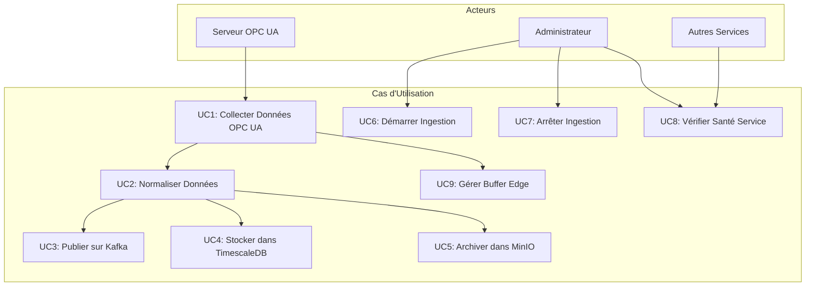
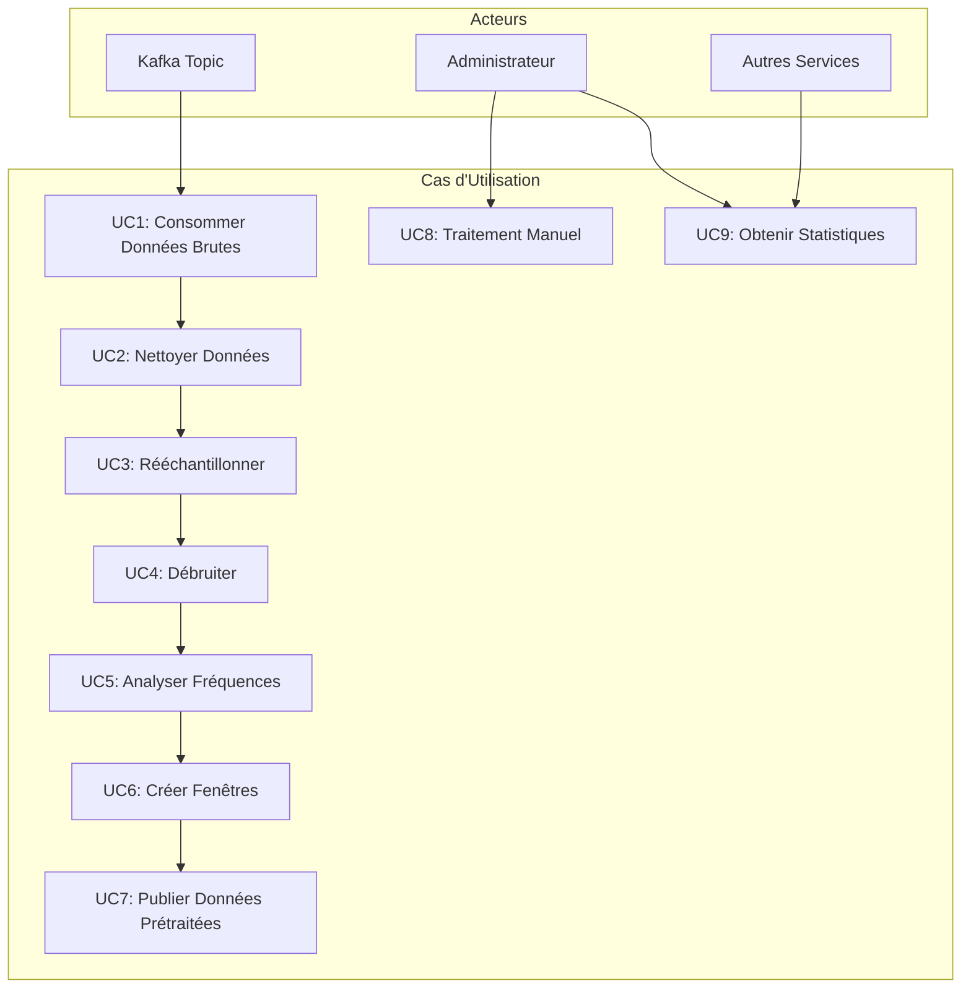
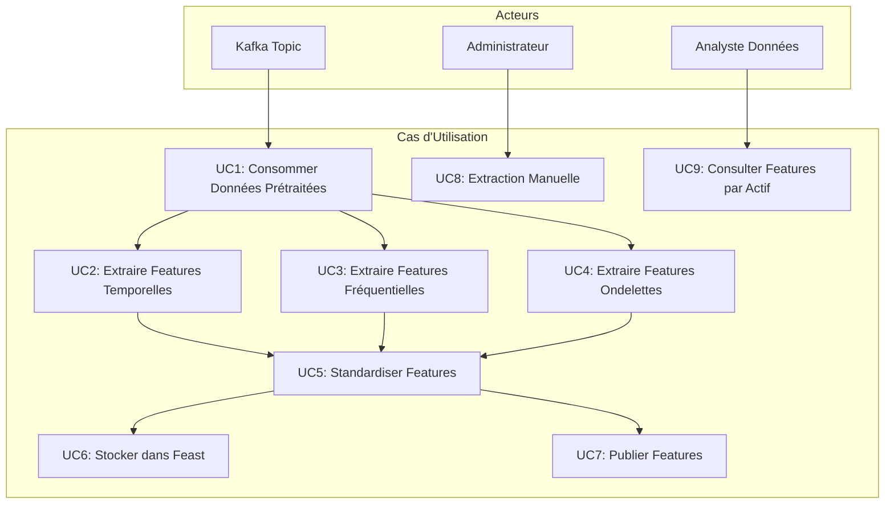
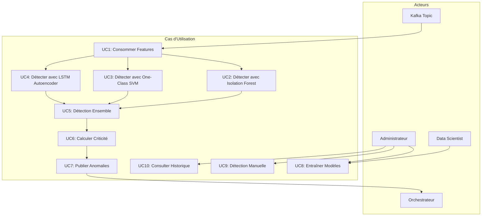
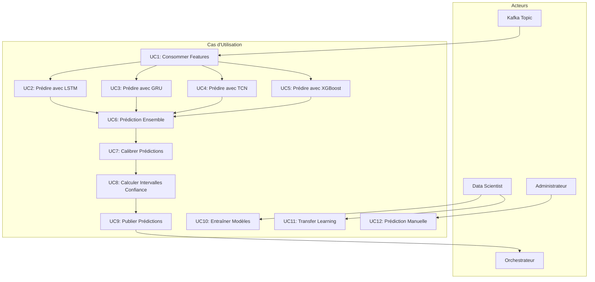
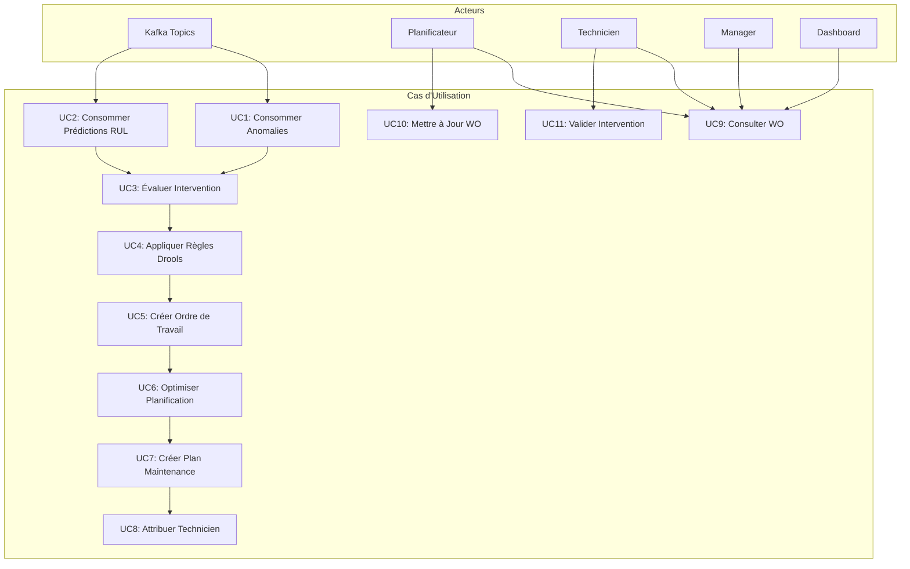
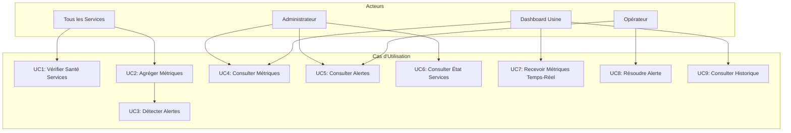
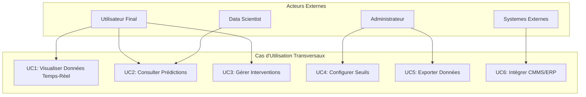
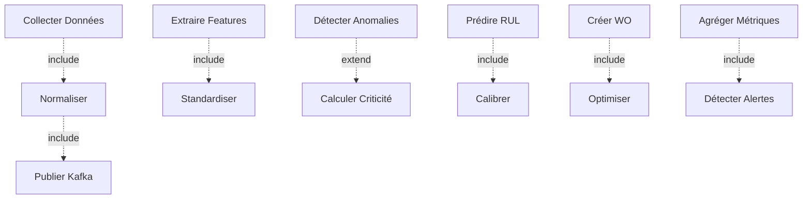

# Diagrammes de Cas d'Utilisation - Microservices

## Vue d'Ensemble

Ce document présente les diagrammes de cas d'utilisation pour chaque microservice de la plateforme de maintenance prédictive.

---

## 1. Service : Ingestion-IIoT

### Diagramme de Cas d'Utilisation

### Description Détaillée des Cas d'Utilisation

#### UC1: Collecter Données OPC UA
- **Acteur Principal** : Serveur OPC UA
- **Préconditions** : Connexion OPC UA établie, nodes configurés
- **Flux Principal** :
  1. Le service se connecte au serveur OPC UA
  2. S'abonne aux nodes configurés
  3. Reçoit les valeurs en temps-réel
  4. Convertit les valeurs au format SensorData
- **Flux Alternatif** :
  - Si connexion échoue : Tentative de reconnexion avec backoff exponentiel
  - Si node indisponible : Log erreur et continue avec autres nodes
- **Postconditions** : Données collectées et prêtes pour traitement

#### UC2: Normaliser Données
- **Acteur Principal** : Service interne
- **Préconditions** : Données brutes reçues
- **Flux Principal** :
  1. Validation du format des données
  2. Conversion des unités si nécessaire
  3. Enrichissement avec métadonnées
  4. Validation des plages de valeurs
- **Postconditions** : Données normalisées et validées

#### UC3: Publier sur Kafka
- **Acteur Principal** : Service interne
- **Préconditions** : Données normalisées disponibles
- **Flux Principal** :
  1. Sérialisation en JSON
  2. Génération de la clé (asset_id + sensor_id)
  3. Publication sur le topic `sensor-data`
  4. Confirmation de livraison
- **Postconditions** : Message disponible sur Kafka

#### UC6: Démarrer Ingestion
- **Acteur Principal** : Administrateur
- **Préconditions** : Service démarré, configuration valide
- **Flux Principal** :
  1. Admin appelle `POST /api/v1/ingestion/start`
  2. Service initialise la connexion OPC UA
  3. Démarre les subscriptions
  4. Retourne confirmation
- **Postconditions** : Ingestion active

---

## 2. Service : Prétraitement

### Diagramme de Cas d'Utilisation

### Description Détaillée

#### UC2: Nettoyer Données
- **Acteur Principal** : Service interne
- **Préconditions** : Données brutes reçues
- **Flux Principal** :
  1. Détection et suppression des outliers (IQR method)
  2. Imputation des valeurs manquantes (interpolation)
  3. Validation de la cohérence temporelle
  4. Suppression des doublons
- **Postconditions** : Données nettoyées

#### UC4: Débruiter
- **Acteur Principal** : Service interne
- **Préconditions** : Données nettoyées disponibles
- **Flux Principal** :
  1. Application d'un filtre passe-bas (Butterworth)
  2. Ou application de débruitage par ondelettes
  3. Préservation des signaux importants
- **Postconditions** : Signal débruité

---

## 3. Service : Extraction-Features

### Diagramme de Cas d'Utilisation

### Description Détaillée

#### UC2: Extraire Features Temporelles
- **Acteur Principal** : Service interne
- **Préconditions** : Données prétraitées disponibles
- **Flux Principal** :
  1. Calcul RMS (Root Mean Square)
  2. Calcul moyenne, écart-type
  3. Calcul skewness, kurtosis
  4. Calcul min, max, range
  5. Agrégation des features
- **Postconditions** : Features temporelles calculées

#### UC5: Standardiser Features
- **Acteur Principal** : Service interne
- **Préconditions** : Features extraites disponibles
- **Flux Principal** :
  1. Identification du type d'actif
  2. Chargement des paramètres de standardisation
  3. Normalisation Z-score par type
  4. Validation des plages
- **Postconditions** : Features standardisées

---

## 4. Service : Détection-Anomalies

### Diagramme de Cas d'Utilisation

### Description Détaillée

#### UC5: Détection Ensemble
- **Acteur Principal** : Service interne
- **Préconditions** : Prédictions des 3 modèles disponibles
- **Flux Principal** :
  1. Agrégation des scores (moyenne pondérée)
  2. Vote majoritaire pour décision binaire
  3. Calcul de la confiance
  4. Sélection du modèle le plus fiable
- **Postconditions** : Score d'anomalie final et décision

#### UC6: Calculer Criticité
- **Acteur Principal** : Service interne
- **Préconditions** : Anomalie détectée
- **Flux Principal** :
  1. Évaluation du score d'anomalie
  2. Consultation du RUL si disponible
  3. Application des règles de criticité
  4. Attribution du niveau (low, medium, high, critical)
- **Postconditions** : Criticité déterminée

#### UC8: Entraîner Modèles
- **Acteur Principal** : Data Scientist / Administrateur
- **Préconditions** : Données d'entraînement disponibles
- **Flux Principal** :
  1. Préparation du dataset
  2. Division train/validation/test
  3. Entraînement de chaque modèle
  4. Évaluation des performances
  5. Enregistrement dans MLflow
  6. Déploiement du meilleur modèle
- **Postconditions** : Modèles entraînés et déployés

---

## 5. Service : Prédiction-RUL

### Diagramme de Cas d'Utilisation

### Description Détaillée

#### UC6: Prédiction Ensemble
- **Acteur Principal** : Service interne
- **Préconditions** : Prédictions de tous les modèles disponibles
- **Flux Principal** :
  1. Agrégation des prédictions (moyenne pondérée)
  2. Calcul de l'incertitude
  3. Sélection de la meilleure prédiction
  4. Calcul de la confiance globale
- **Postconditions** : RUL prédit avec intervalle de confiance

#### UC7: Calibrer Prédictions
- **Acteur Principal** : Service interne
- **Préconditions** : Prédictions brutes disponibles
- **Flux Principal** :
  1. Chargement des données de calibration
  2. Application de la calibration (Platt scaling)
  3. Ajustement des prédictions
  4. Mise à jour des intervalles de confiance
- **Postconditions** : Prédictions calibrées

#### UC11: Transfer Learning
- **Acteur Principal** : Data Scientist
- **Préconditions** : Modèle pré-entraîné disponible
- **Flux Principal** :
  1. Chargement du modèle source
  2. Adaptation pour le nouvel actif
  3. Fine-tuning avec données limitées
  4. Validation des performances
  5. Déploiement si acceptable
- **Postconditions** : Modèle adapté déployé

---

## 6. Service : Orchestrateur-Maintenance

### Diagramme de Cas d'Utilisation

### Description Détaillée

#### UC3: Évaluer Intervention
- **Acteur Principal** : Service interne
- **Préconditions** : Anomalie ou prédiction RUL reçue
- **Flux Principal** :
  1. Analyse de la criticité
  2. Consultation de l'historique de l'actif
  3. Évaluation de l'urgence
  4. Décision d'intervention requise ou non
- **Postconditions** : Décision d'intervention prise

#### UC4: Appliquer Règles Drools
- **Acteur Principal** : Service interne
- **Préconditions** : Intervention requise identifiée
- **Flux Principal** :
  1. Chargement des règles métier (DRL)
  2. Insertion des faits (anomalie, RUL, actif)
  3. Exécution du moteur de règles
  4. Récupération des décisions
  5. Application des recommandations
- **Postconditions** : Priorité et type d'intervention déterminés

#### UC6: Optimiser Planification
- **Acteur Principal** : Service interne
- **Préconditions** : Liste d'interventions à planifier
- **Flux Principal** :
  1. Modélisation du problème (OR-Tools)
  2. Définition des contraintes (hard/soft)
  3. Résolution du problème d'optimisation
  4. Validation de la solution
  5. Génération du plan optimisé
- **Postconditions** : Plan de maintenance optimisé créé

---

## 7. Service : Dashboard-Monitoring

### Diagramme de Cas d'Utilisation

### Description Détaillée

#### UC1: Vérifier Santé Services
- **Acteur Principal** : Service interne / Autres services
- **Préconditions** : Services démarrés
- **Flux Principal** :
  1. Appel de `/actuator/health` de chaque service
  2. Vérification du temps de réponse
  3. Évaluation de l'état (UP, DOWN, DEGRADED)
  4. Enregistrement du statut
- **Postconditions** : État de santé connu

#### UC3: Détecter Alertes
- **Acteur Principal** : Service interne
- **Préconditions** : Métriques collectées
- **Flux Principal** :
  1. Comparaison avec les seuils configurés
  2. Détection des dépassements
  3. Évaluation de la sévérité
  4. Création d'alertes si nécessaire
  5. Notification si critique
- **Postconditions** : Alertes créées et notifiées

#### UC7: Recevoir Métriques Temps-Réel
- **Acteur Principal** : Dashboard Usine
- **Préconditions** : Connexion WebSocket établie
- **Flux Principal** :
  1. Connexion WebSocket au dashboard
  2. Envoi périodique des métriques (toutes les 5s)
  3. Envoi immédiat des alertes critiques
  4. Gestion de la reconnexion automatique
- **Postconditions** : Dashboard mis à jour en temps-réel

---

## 8. Cas d'Utilisation Transversaux

### Diagramme Global

### Description Détaillée

#### UC1: Visualiser Données Temps-Réel
- **Acteur Principal** : Utilisateur Final
- **Préconditions** : Dashboard accessible, services actifs
- **Flux Principal** :
  1. Connexion au dashboard
  2. Sélection d'un actif
  3. Affichage des données temps-réel (graphiques)
  4. Mise à jour automatique via WebSocket
  5. Visualisation sur carte GIS
- **Postconditions** : Données visualisées en temps-réel

#### UC3: Gérer Interventions
- **Acteur Principal** : Utilisateur Final / Planificateur
- **Préconditions** : Interventions créées
- **Flux Principal** :
  1. Consultation de la liste des interventions
  2. Filtrage par statut, priorité, actif
  3. Consultation des détails
  4. Mise à jour du statut
  5. Attribution manuelle si nécessaire
- **Postconditions** : Interventions gérées

#### UC6: Intégrer CMMS/ERP
- **Acteur Principal** : Systèmes Externes
- **Préconditions** : APIs d'intégration configurées
- **Flux Principal** :
  1. Réception d'un ordre de travail créé
  2. Transformation au format CMMS/ERP
  3. Envoi via API REST
  4. Confirmation de réception
  5. Synchronisation des statuts
- **Postconditions** : Données synchronisées

---

## 9. Relations entre Cas d'Utilisation

### Diagramme de Relations

### Types de Relations

- **Include** : Le cas d'utilisation source inclut toujours le cas cible
- **Extend** : Le cas d'utilisation source peut étendre le cas cible dans certaines conditions
- **Generalization** : Relation de spécialisation

---

## 10. Scénarios d'Utilisation Complets

### Scénario 1 : Détection et Intervention sur Anomalie Critique

1. **Collecte** : Ingestion-IIoT collecte une valeur anormale
2. **Prétraitement** : Données nettoyées et normalisées
3. **Extraction** : Features extraites
4. **Détection** : Anomalie détectée avec score élevé
5. **Orchestration** : WO créé avec priorité critique
6. **Planification** : Plan optimisé généré
7. **Notification** : Technicien notifié
8. **Intervention** : Intervention réalisée
9. **Validation** : WO clôturé
10. **Monitoring** : Métriques mises à jour

### Scénario 2 : Prédiction RUL et Planification Préventive

1. **Collecte Continue** : Données collectées sur plusieurs jours
2. **Extraction** : Features historiques extraites
3. **Prédiction** : RUL prédit < 60 jours
4. **Orchestration** : Intervention préventive planifiée
5. **Optimisation** : Plan optimisé pour fenêtre de maintenance
6. **Planification** : WO créé avec date optimale
7. **Exécution** : Maintenance préventive réalisée
8. **Mise à Jour** : Modèles ML mis à jour avec données réelles

---

## Conclusion

Ces diagrammes de cas d'utilisation décrivent l'ensemble des interactions possibles avec chaque microservice, facilitant la compréhension des fonctionnalités, des acteurs impliqués et des flux de traitement. Ils servent de base pour les tests, la documentation utilisateur et la formation.

