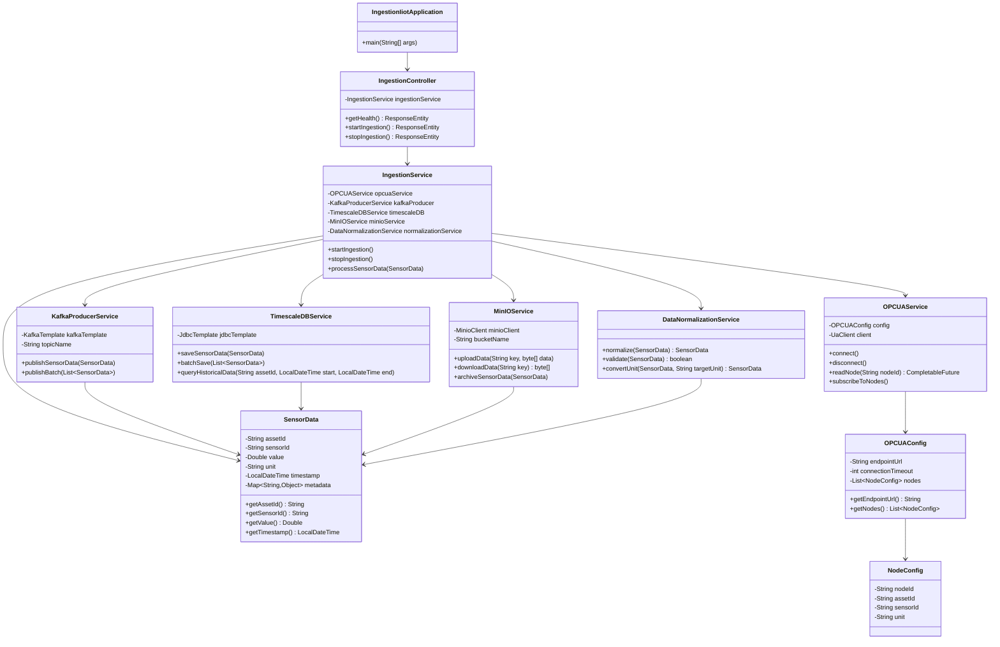
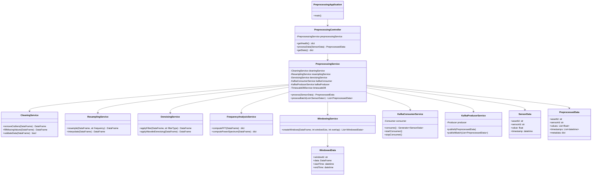
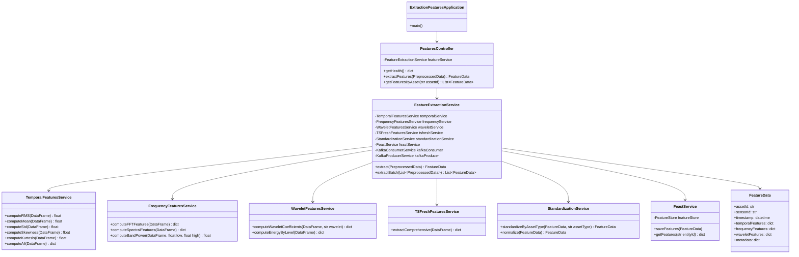
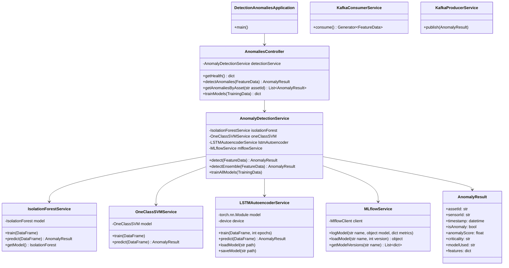
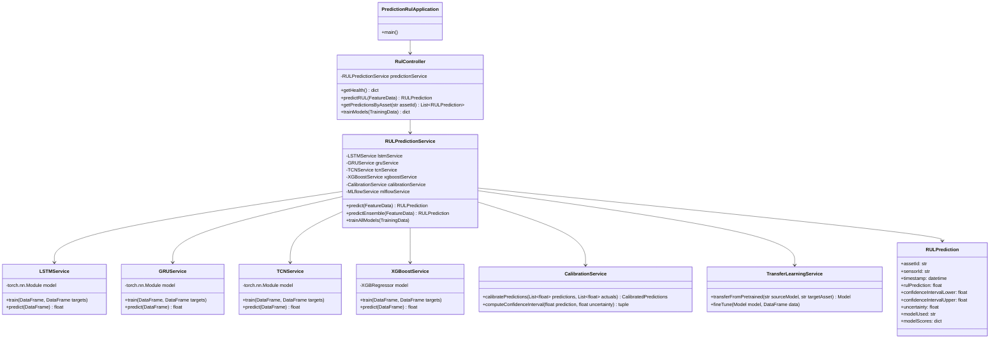
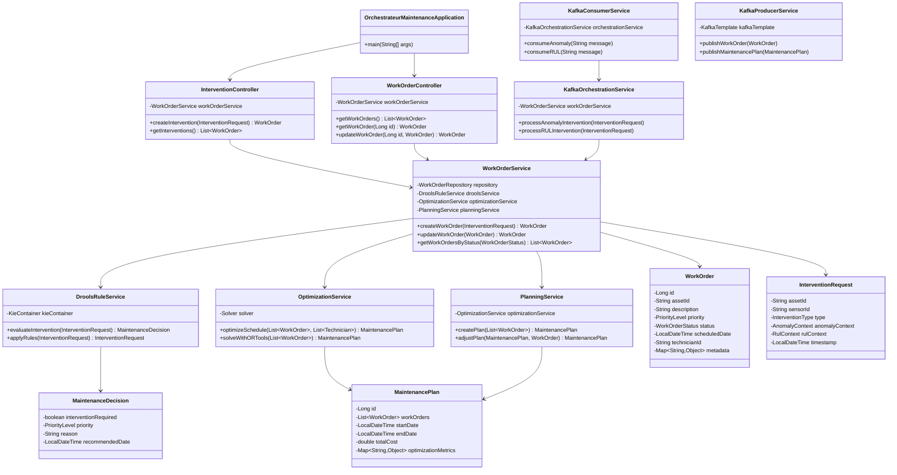
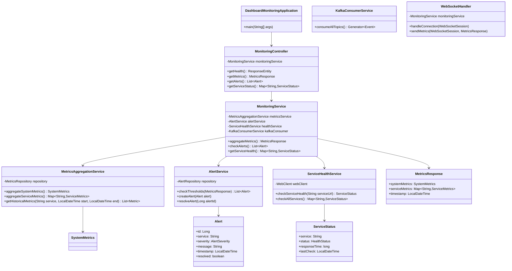

# Diagrammes de Classes - Microservices

## Vue d'Ensemble

Ce document présente les diagrammes de classes pour chaque microservice de la plateforme de maintenance prédictive.

---

## 1. Service : Ingestion-IIoT

### Diagramme de Classes



### Description des Classes

#### IngestionController
- **Responsabilité** : Point d'entrée REST pour contrôler l'ingestion
- **Méthodes principales** :
  - `getHealth()` : Vérification de l'état du service
  - `startIngestion()` : Démarrage de la collecte
  - `stopIngestion()` : Arrêt de la collecte

#### IngestionService
- **Responsabilité** : Orchestration de la collecte et du traitement des données
- **Méthodes principales** :
  - `startIngestion()` : Initialise la connexion OPC UA et démarre la collecte
  - `processSensorData()` : Traite chaque donnée collectée

#### OPCUAService
- **Responsabilité** : Communication avec les serveurs OPC UA
- **Méthodes principales** :
  - `connect()` : Établit la connexion
  - `readNode()` : Lit une valeur depuis un node OPC UA
  - `subscribeToNodes()` : S'abonne aux changements de valeurs

#### SensorData
- **Responsabilité** : Modèle de données pour les valeurs capteurs
- **Attributs** :
  - `assetId` : Identifiant de l'équipement
  - `sensorId` : Identifiant du capteur
  - `value` : Valeur mesurée
  - `timestamp` : Horodatage

---

## 2. Service : Prétraitement

### Diagramme de Classes



---

## 3. Service : Extraction-Features

### Diagramme de Classes



---

## 4. Service : Détection-Anomalies

### Diagramme de Classes



---

## 5. Service : Prédiction-RUL

### Diagramme de Classes



---

## 6. Service : Orchestrateur-Maintenance

### Diagramme de Classes



---

## 7. Service : Dashboard-Monitoring

### Diagramme de Classes



---

## 8. Relations Inter-Services

### Diagramme de Relations Globales

```mermaid
classDiagram
    class IngestionService {
        +SensorData
    }
    
    class PreprocessingService {
        +PreprocessedData
    }
    
    class FeatureExtractionService {
        +FeatureData
    }
    
    class AnomalyDetectionService {
        +AnomalyResult
    }
    
    class RULPredictionService {
        +RULPrediction
    }
    
    class OrchestrateurService {
        +WorkOrder
        +MaintenancePlan
    }
    
    class MonitoringService {
        +MetricsResponse
        +Alert
    }
    
    IngestionService -->|Kafka| PreprocessingService : sensor-data
    PreprocessingService -->|Kafka| FeatureExtractionService : preprocessed-data
    FeatureExtractionService -->|Kafka| AnomalyDetectionService : extracted-features
    FeatureExtractionService -->|Kafka| RULPredictionService : extracted-features
    AnomalyDetectionService -->|Kafka| OrchestrateurService : anomalies-detected
    RULPredictionService -->|Kafka| OrchestrateurService : rul-predictions
    OrchestrateurService -->|REST| MonitoringService
    MonitoringService -->|WebSocket| DashboardUsine
```

---

## Conclusion

Ces diagrammes de classes illustrent la structure interne de chaque microservice, montrant les responsabilités, les relations et les dépendances entre les composants. Cette modélisation facilite la compréhension, la maintenance et l'évolution du système.

