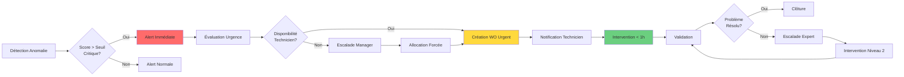
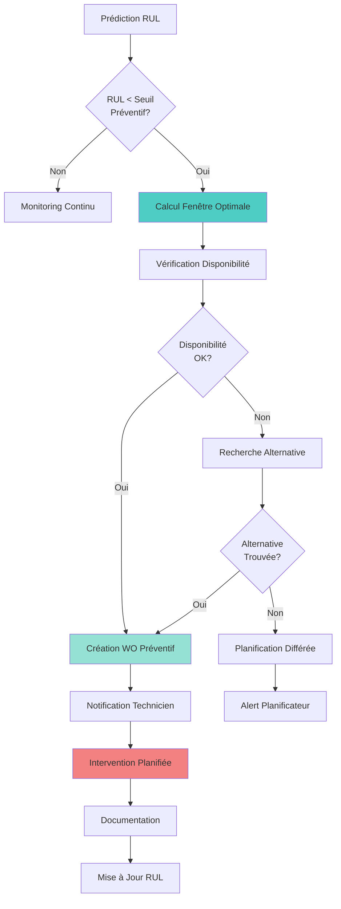
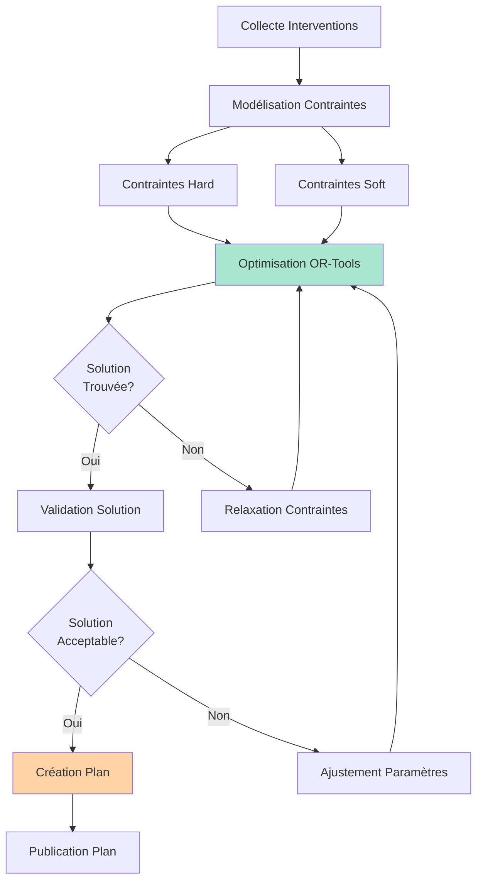
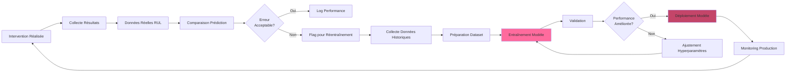
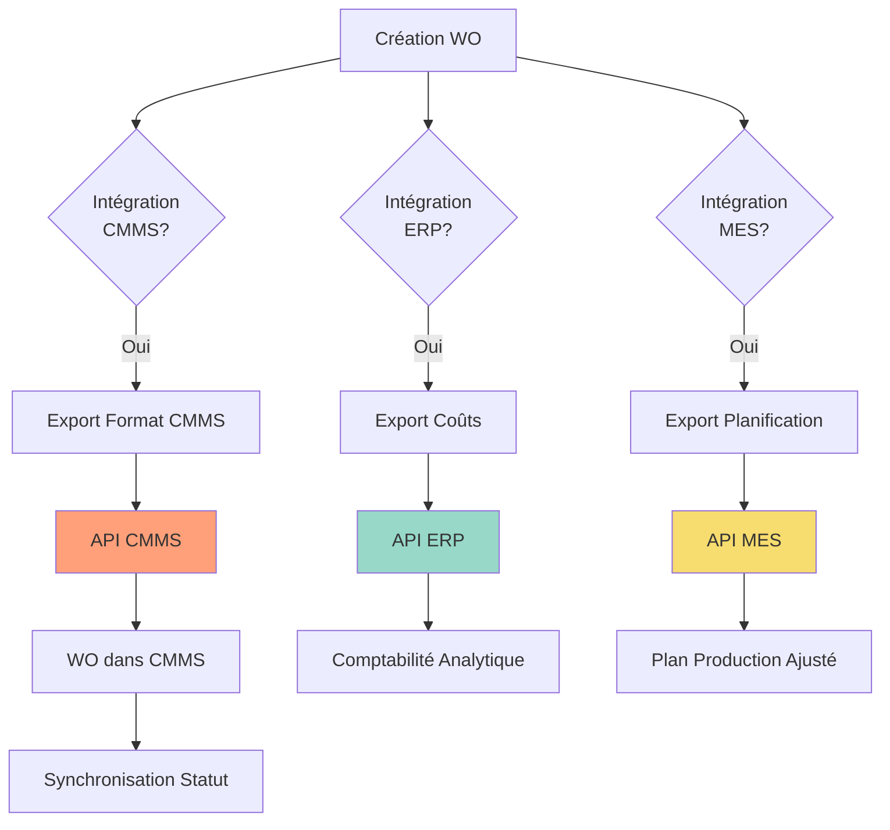

# Diagramme BPMN - Processus Métiers de Maintenance Prédictive

## Vue d'Ensemble

Ce document décrit les processus métiers de la plateforme de maintenance prédictive en utilisant la notation BPMN (Business Process Model and Notation).

---

## 1. Processus Principal : Cycle de Vie de la Maintenance Prédictive

### Description du Processus

Le processus principal couvre l'ensemble du cycle de vie depuis la collecte des données jusqu'à l'exécution de la maintenance.

```mermaid
graph TB
    Start([Début]) --> Collecte[Collecte Données IIoT]
    Collecte --> Validation{Données<br/>Valides?}
    Validation -->|Non| Rejet[Rejeter Données
    Rejet --> Collecte
    Validation -->|Oui| Pretraitement[Prétraitement Données]
    Pretraitement --> Extraction[Extraction Caractéristiques]
    Extraction --> Parallele{Parallélisation}
    
    Parallele --> Detection[Détection Anomalies]
    Parallele --> Prediction[Prédiction RUL]
    
    Detection --> EvaluationAnomalie{Anomalie<br/>Critique?}
    Prediction --> EvaluationRUL{RUL <br/>Seuil?}
    
    EvaluationAnomalie -->|Oui| Orchestration[Orchestration Maintenance]
    EvaluationRUL -->|Oui| Orchestration
    EvaluationAnomalie -->|Non| Monitoring[Monitoring Continu]
    EvaluationRUL -->|Non| Monitoring
    
    Orchestration --> Planification[Planification Optimisée]
    Planification --> CreationWO[Création Ordre de Travail]
    CreationWO --> Attribution[Attribution Technicien]
    Attribution --> Execution[Exécution Maintenance]
    Execution --> Verification{Maintenance<br/>Réussie?}
    Verification -->|Non| Replanification[Replanification]
    Replanification --> Planification
    Verification -->|Oui| Documentation[Documentation Intervention]
    Documentation --> MiseAJour[Mise à Jour Modèles ML]
    MiseAJour --> Monitoring
    Monitoring --> Collecte
    
    style Start fill:#90EE90
    style Collecte fill:#87CEEB
    style Orchestration fill:#FFB6C1
    style Execution fill:#DDA0DD
    style Monitoring fill:#F0E68C
```

### Étapes Détaillées

#### 1.1 Collecte Données IIoT
- **Acteur** : Service Ingestion-IIoT
- **Description** : Collecte continue des données depuis les équipements industriels via OPC UA, Modbus, MQTT
- **Fréquence** : Temps-réel (1-10 Hz selon le capteur)
- **Données** : Température, vibration, pression, courant, etc.
- **Sortie** : Messages Kafka sur le topic `sensor-data`

#### 1.2 Validation des Données
- **Critères** : 
  - Valeurs dans les plages acceptables
  - Timestamp valide
  - Format correct
- **Action si invalide** : Rejet et logging pour analyse

#### 1.3 Prétraitement
- **Acteur** : Service Prétraitement
- **Opérations** :
  - Nettoyage (valeurs manquantes, outliers)
  - Rééchantillonnage temporel
  - Débruitage (filtres)
  - Normalisation
- **Sortie** : Données prétraitées sur Kafka topic `preprocessed-data`

#### 1.4 Extraction Caractéristiques
- **Acteur** : Service Extraction-Features
- **Caractéristiques extraites** :
  - Temporelles : RMS, moyenne, écart-type, skewness, kurtosis
  - Fréquentielles : FFT, spectre de puissance, bandes de fréquence
  - Wavelets : Coefficients DWT
- **Sortie** : Features sur Kafka topic `extracted-features`

#### 1.5 Détection Anomalies (Parallèle)
- **Acteur** : Service Détection-Anomalies
- **Modèles** :
  - Isolation Forest
  - One-Class SVM
  - LSTM Autoencoder
- **Sortie** : Score d'anomalie + criticité sur Kafka topic `anomalies-detected`

#### 1.6 Prédiction RUL (Parallèle)
- **Acteur** : Service Prédiction-RUL
- **Modèles** :
  - LSTM
  - GRU
  - TCN (Temporal Convolutional Network)
  - XGBoost (ensemble)
- **Sortie** : RUL prédit + intervalle de confiance sur Kafka topic `rul-predictions`

#### 1.7 Orchestration Maintenance
- **Acteur** : Service Orchestrateur-Maintenance
- **Déclencheurs** :
  - Anomalie critique détectée
  - RUL < seuil critique (ex: 30 jours)
- **Actions** :
  - Évaluation de la criticité (Drools)
  - Création d'intervention
  - Optimisation de la planification (OR-Tools)

#### 1.8 Planification Optimisée
- **Contraintes** :
  - Disponibilité des techniciens
  - Contraintes de sécurité
  - Fenêtres de maintenance
  - Coûts
- **Objectif** : Minimiser le temps total et maximiser l'efficacité

#### 1.9 Exécution Maintenance
- **Acteur** : Technicien
- **Étapes** :
  - Réception de l'ordre de travail
  - Préparation (outils, pièces)
  - Intervention sur site
  - Tests de validation
  - Documentation

#### 1.10 Mise à Jour Modèles
- **Acteur** : Services ML
- **Données** : Résultats de maintenance réels
- **Objectif** : Améliorer la précision des prédictions

---

## 2. Processus : Gestion des Anomalies Critiques

### Description

Processus détaillé pour la gestion des anomalies critiques nécessitant une intervention immédiate.



### Règles Métier (Drools)

1. **Anomalie Critique** : Score > 0.9 OU (Score > 0.7 ET RUL < 7 jours)
2. **SLA Critique** : Intervention dans 1 heure
3. **Escalade** : Si pas de technicien disponible, notifier le manager
4. **Allocation Forcée** : Manager peut réaffecter un technicien d'une tâche non-critique

---

## 3. Processus : Planification Préventive Basée sur RUL

### Description

Processus pour la planification des maintenances préventives basées sur les prédictions RUL.



### Seuils RUL

- **Critique** : RUL < 30 jours → Intervention urgente
- **Haute Priorité** : RUL < 60 jours → Intervention dans 1 semaine
- **Moyenne Priorité** : RUL < 90 jours → Intervention dans 1 mois
- **Basse Priorité** : RUL < 120 jours → Intervention dans 3 mois

---

## 4. Processus : Optimisation de la Planification

### Description

Processus d'optimisation utilisant OR-Tools pour résoudre le problème de planification.



### Contraintes

**Hard (Obligatoires)** :
- Un technicien ne peut être à deux endroits en même temps
- Respect des fenêtres de maintenance
- Contraintes de sécurité (ex: arrêt machine nécessaire)

**Soft (Optimisation)** :
- Minimiser les temps de déplacement
- Maximiser l'utilisation des techniciens
- Équilibrer la charge de travail

---

## 5. Processus : Amélioration Continue des Modèles ML

### Description

Processus de rétroaction pour améliorer les modèles ML avec les données réelles.



### Métriques de Performance

- **MAE (Mean Absolute Error)** : < 10% de la RUL réelle
- **RMSE (Root Mean Square Error)** : < 15% de la RUL réelle
- **Précision Anomalies** : > 95%
- **Rappel Anomalies** : > 90%

---

## 6. Processus : Intégration avec Systèmes Externes

### Description

Processus d'intégration avec les systèmes CMMS, ERP, MES existants.



---

## 7. Rôles et Responsabilités

### Acteurs du Processus

1. **Système IIoT** : Collecte automatique des données
2. **Services ML** : Détection et prédiction automatiques
3. **Orchestrateur** : Décision et planification automatiques
4. **Planificateur** : Validation et ajustement manuels
5. **Technicien** : Exécution des interventions
6. **Manager** : Supervision et escalade
7. **Expert** : Résolution de problèmes complexes

---

## 8. Métriques et KPIs

### KPIs Processus

1. **Temps de Réaction** : < 1h pour anomalies critiques
2. **Précision Prédictions** : > 90% pour RUL
3. **Taux de Faux Positifs** : < 5%
4. **Taux d'Utilisation Techniciens** : > 80%
5. **Respect Planning** : > 95%
6. **Coût Maintenance** : Réduction de 20% vs maintenance réactive

---

## 9. Exceptions et Gestion d'Erreurs

### Scénarios d'Exception

1. **Données Manquantes** : Utilisation de valeurs par défaut ou interpolation
2. **Service Indisponible** : Mode dégradé avec cache local
3. **Modèle Non Entraîné** : Utilisation de règles heuristiques
4. **Technicien Indisponible** : Escalade automatique
5. **Intervention Échouée** : Replanification avec priorité élevée

---

## 10. Automatisation vs Intervention Manuelle

### Automatique
- Collecte données
- Prétraitement
- Détection anomalies
- Prédiction RUL
- Création WO pour cas standards
- Planification optimisée

### Manuelle
- Validation décisions critiques
- Ajustement planification complexe
- Escalade problèmes
- Validation interventions
- Ajustement modèles ML

---

## Conclusion

Ces processus BPMN décrivent l'ensemble du cycle de vie de la maintenance prédictive, de la collecte des données à l'amélioration continue des modèles. L'automatisation est maximale tout en conservant des points de contrôle humains pour les décisions critiques.

